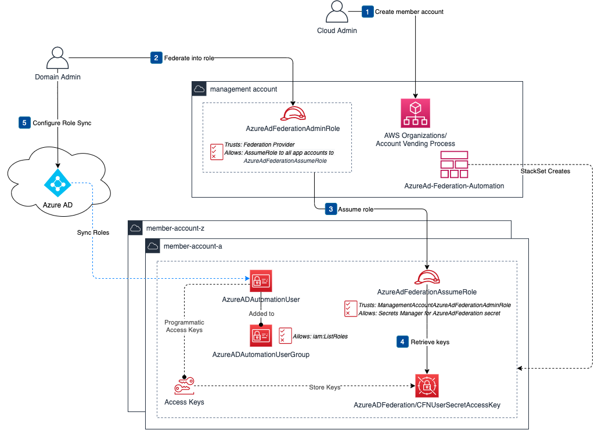

## AWS Control Tower Customizations to automate SAML 2.0 Federation with Azure AD

Use these templates for AWS Control Tower Customers leveraging the Customizations for AWS Control Tower solution to enable SAML 2.0 federation from Azure AD to AWS. The solution uses automation to accelerate the onboarding of new member accounts by allowing AD admins the ability to securely configure user provisioning directly.  

A diagram of the workflow is included below.  

## Prerequisites 
* AWS Control Tower
* [Customizations for AWS Control Tower](https://aws.amazon.com/solutions/implementations/customizations-for-aws-control-tower/)

## Usage
Deploy the following templates using the Customizations for AWS Control Tower.  

**azuread-fed-management-account.yaml** - Must be deployed to the management account  
**azuread-fed-member-account.yaml** - Must be deployed to all member accounts requiring Azure AD federation  

### Configure federation to the management account
1) Log in to the management account and navigate to the AWS Secrets Manager Console.
2) Navigate to `AzureADFederation/CFNUserSecretAccessKey` secret and retrieve the stored secrets.
3) In the Azure AD EA for the management account:
    1) Enable [user provisioning](https://docs.microsoft.com/en-us/azure/active-directory/saas-apps/amazon-web-service-tutorial#how-to-configure-role-provisioning-in-amazon-web-services-aws) using the secret values AccessKey and SecretKey.
    2) Map the synced `AzureAdFederationAdminRole` to the appropriate group in AD.

### Configure federation to the member accounts
1) Federate into the management account using the AzureAdFederationAdminRole. 
2) For each member account, follow these steps:
    1) Switch role to the member account using the account Id and the `AzureAdFederationAssumeRole`.
    2) Access the AWS Secrets Manager console.
    3) Choose the `AzureADFederation/CFNUserSecretAccessKey` secret and retrieve the stored secrets.
    4) In the Azure AD EA for the management account, enable user provisioning using the secret values AccessKey and SecretKey.

## Security

See [CONTRIBUTING](CONTRIBUTING.md#security-issue-notifications) for more information.

## License

This library is licensed under the MIT-0 License. See the LICENSE file.

